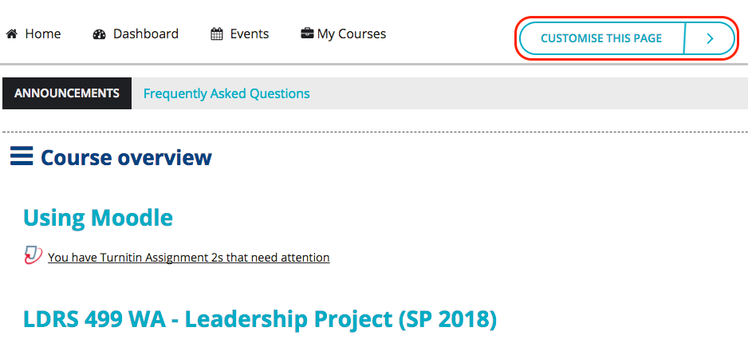
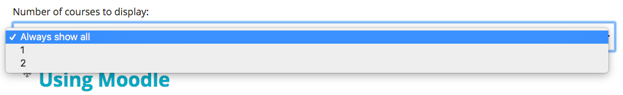

# Editing your Course List

From your Moodle Dashboard, click 'Customize this page'.

## Click and drag the 4-way arrows to reorder your courses so that your current courses are at the top of the list.

## Adjust the number of courses to display to only show your current courses.

