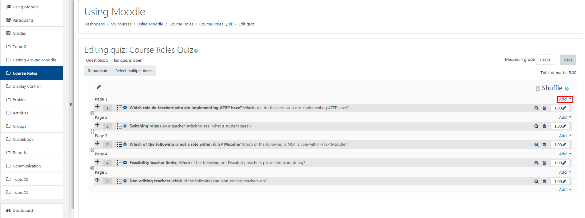
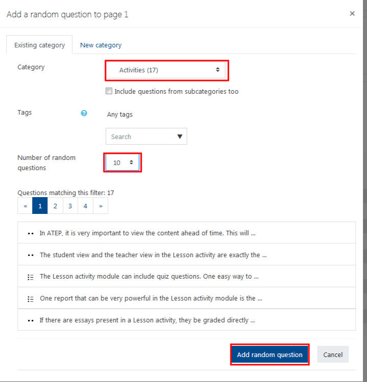

# Add a question pool

## Choose "+ a random question"

1. Choose the category from which to draw the questions. \(The number of questions in the pool will be in parentheses\).
2. Choose the number of questions.
3. Click 'Add random question'.

## Be pleased with yourself.

### For Further Assistance

The eSupport Team is a group of dedicated students and staff members who work to improve the Moodle learning experience for students and Instructors alike. A member of TWU Extension, the eSupport Team is located in the Northwest Building of TWU’s Langley campus. Whether your question is simple or complicated, a Team member will get back to you in a timely manner with a thorough response. eSupport also offers Basic and Advanced Moodle trainings, either in-person or over the phone. Contact [eSupport](https://trinitywestern.teamdynamix.com/TDClient/Requests/ServiceDet?ID=16141) for assistance making Moodle work for you.
