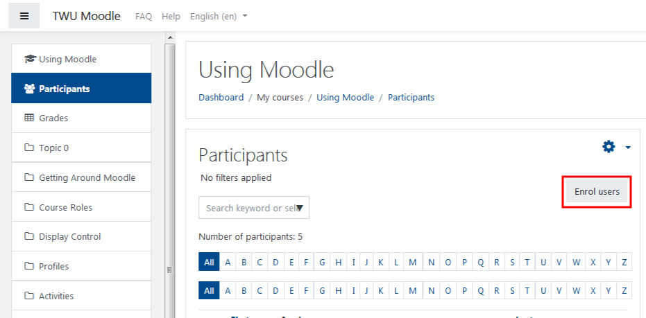
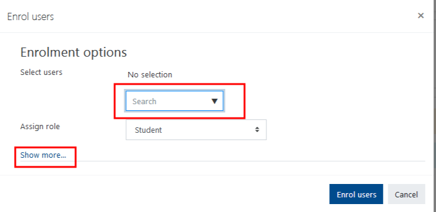

# Adding a User

Students can only be enrolled in courses by the Registrar's Office.

Users with the following roles can add users to Moodle courses.

### Managers can enrol:

* Manager
* Teacher
* Non-editing teacher
* Full TA
* Non-editing TA
* Non-grading TA

### Teachers can enrol:

* Teacher
* Non-editing teacher
* Full TA
* Non-editing TA
* Non-grading TA

No other users can enrol other users.

NOTE: We cannot create accounts for users who are not members of the TWU Community.

## Select the 'Users' option in your Administration block, then select the 'Enrolled Users' option.

Note: Your Administration block maybe located on the right hand side of your page or it maybe docked on the left side, so location may vary for you the user :-\).

## Click 'Enrol Users'

## Choose a role from the dropdown menu and use the search box to find the user.

You may desire to add further stipulation to the user's enrollment.

## Click 'Enrol' once the user has been added.

### For Further Assistance

The eSupport Team is a group of dedicated students and staff members who work to improve the Moodle learning experience for students and Instructors alike. A member of TWU Extension, the eSupport Team is located in the Northwest Building of TWU’s Langley campus. Whether your question is simple or complicated, a Team member will get back to you in a timely manner with a thorough response. eSupport also offers Basic and Advanced Moodle trainings, either in-person or over the phone. Contact [eSupport](https://trinitywestern.teamdynamix.com/TDClient/Requests/ServiceDet?ID=16141) for assistance making Moodle work for you.

