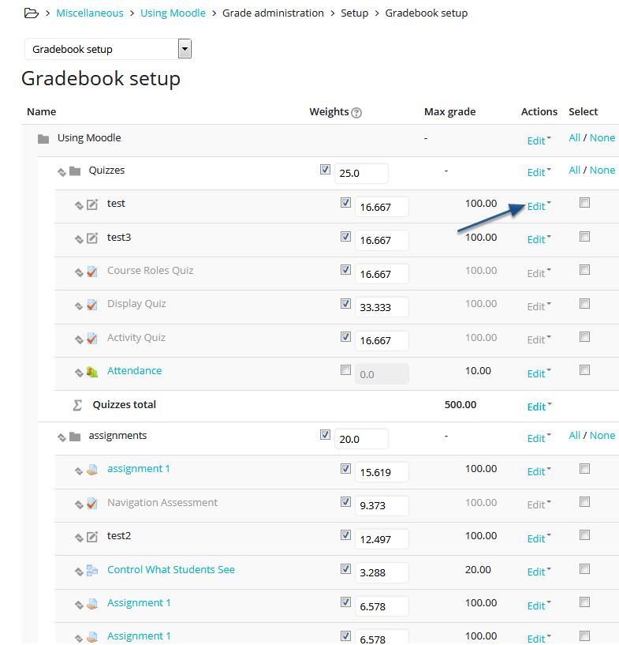
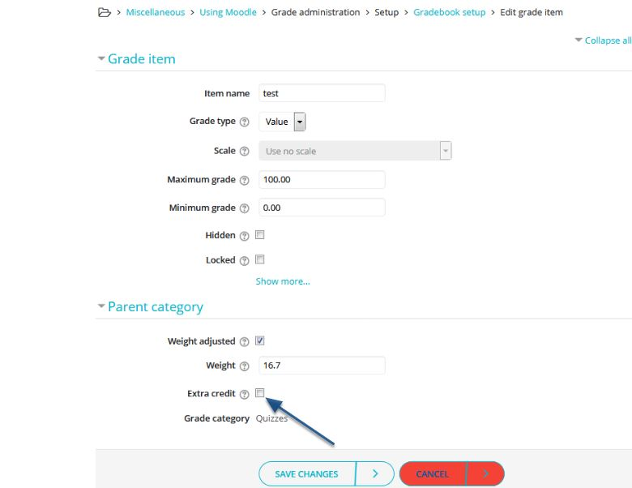

# Adding Extra Credit to Gradebook

So you've decided to incorporate extra credit into your gradebook? 

### If the item is already created in your gradebook simply access its settings.

You may select any item in your gradebook to distinguish as 'Extra Credit'. 

Just check that box!

Open the item's settings, scroll to 'Parent Category' part of the settings, then check the box for 'Extra Credit'. 

### Thats it!

Once you return to the gradebook, the grade item should have a little "+" sign next to it. Feel free to connect with the following link for further details on how extra credit works.

