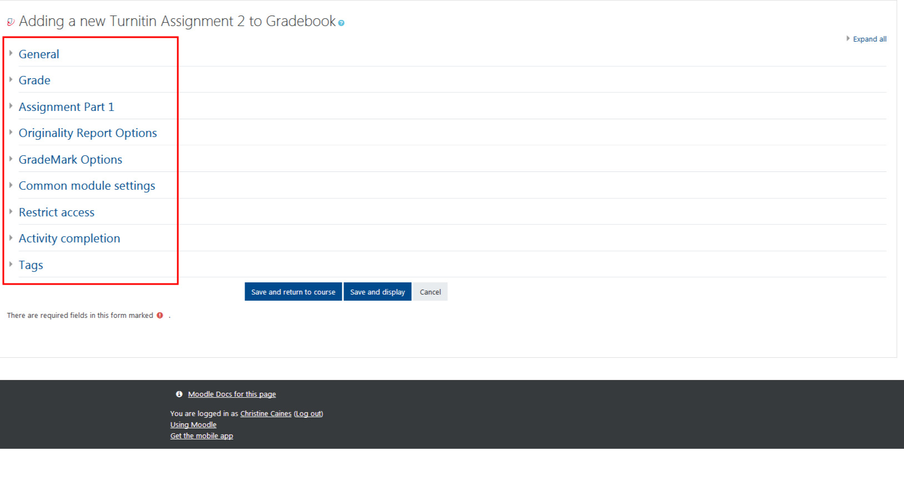
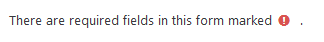

# Adding Turnitin Assignments

Please note: _**Turnitin.com cannot and does not detect plagiarism.**_ It is a moderately effective tool that can be used as the basis for conversations between students and faculty about academic integrity.

## Remember: Always turn editing on.

Your next task is to add an activity or resource. 

Choose Turnitin Assignment 2 from the Activity menu. Then click **Add**.

## Next, add details. There are many options to choose from, the most important settings are in General and Assignment Part 1, these important sections are marked by red exclamation marks.

## Other Settings in Turnitin.

You may set the parameters for your assignment dropbox using the following options. You can set the due date and cut off date, add the max grade and assign it to a category in your gradebook, etc.

**Note** You must select a time from the 24 hour clock, it is often convenient to make an assignment due at 23:55, or 11:55PM, on the date that it is due to avoid due date mix ups for students.

Once options are selected click **Save and return to course or display** to preview your drop box.

## For Further Assistance

The eSupport Team is a group of dedicated students and staff members who work to improve the Moodle learning experience for students and Instructors alike. A member of TWU Extension, the eSupport Team is located in the Northwest Building of TWU’s Langley campus. Whether your question is simple or complicated, a Team member will get back to you in a timely manner with a thorough response. eSupport also offers Basic and Advanced Moodle trainings, either in-person or over the phone. Contact [eSupport](https://trinitywestern.teamdynamix.com/TDClient/Requests/ServiceDet?ID=16141) for assistance making Moodle work for you.

