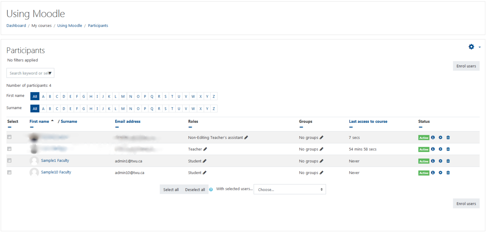
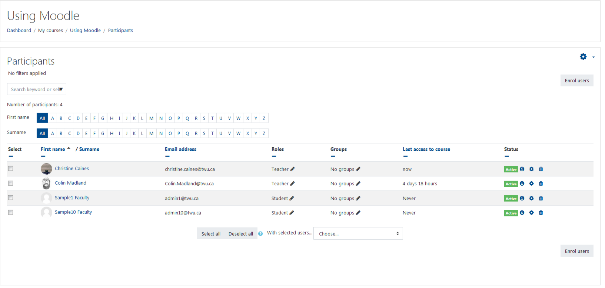
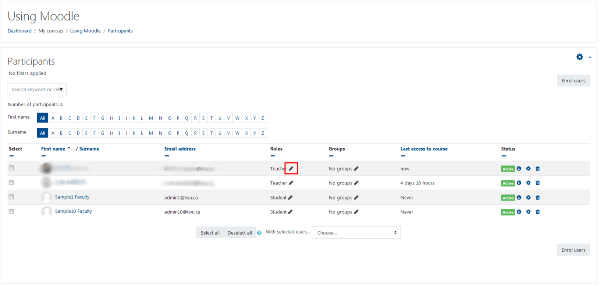
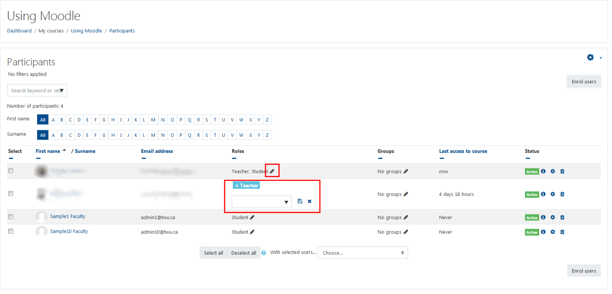
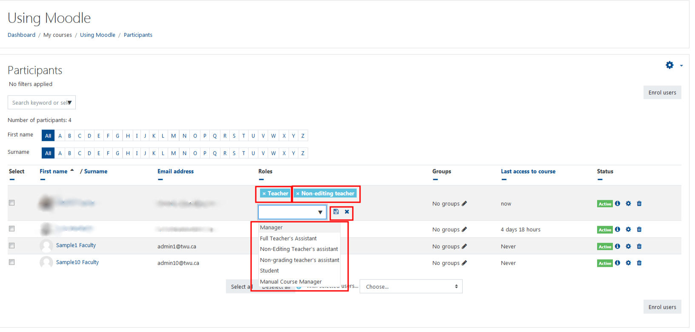

# Assigning a Role

### Professors now have the option of assigning roles such as Teacher Assistant or Non-editing Teacher to users in their course. Please follow the instructions below to complete this task.

## First, you'll want to open your course.

Select the 'Participants' option under your course functions on the left of the page, next you have the option to add the user (see instructions on 'Adding a User') or if the user is already a participant but you are desiring to assign them another role, then follow these next steps.

## Your window should open to a page with a list of the students and other users enrolled in your course.

The page should look something like this.

The 'Participants' page shows the roles of the user, select the pencil to alter the the user's role.

You have a few options to assign the roles of Manager, Non-editing teacher, Teacher's Assistant, Non-Grading Teacher's Assistant and Teacher.

Once you've assigned the appropriate role save changes by selecting the little discette.

## Congrats you've completed assigning a role to a user successfully.

## That's it!

### For Further Assistance

The eSupport Team is a group of dedicated students and staff members who work to improve the Moodle learning experience for students and Instructors alike. A member of TWU Extension, the eSupport Team is located in the Northwest Building of TWU’s Langley campus. Whether your question is simple or complicated, a Team member will get back to you in a timely manner with a thorough response. eSupport also offers Basic and Advanced Moodle trainings, either in-person or over the phone. Contact [eSupport](https://trinitywestern.teamdynamix.com/TDClient/Requests/ServiceDet?ID=16141) for assistance making Moodle work for you.
