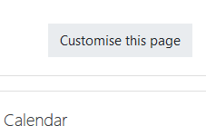
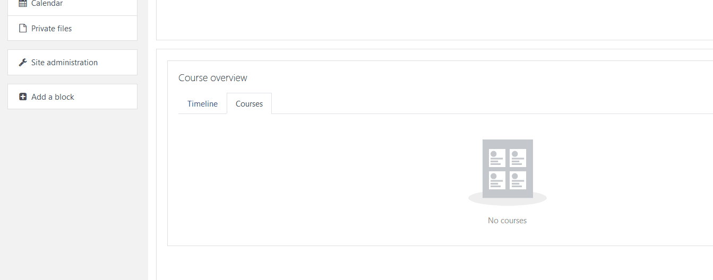
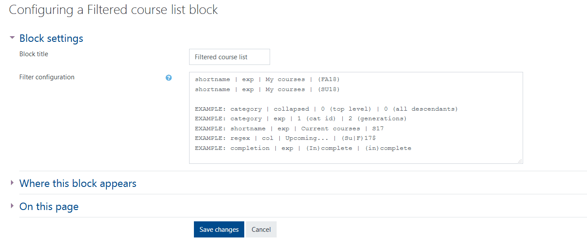
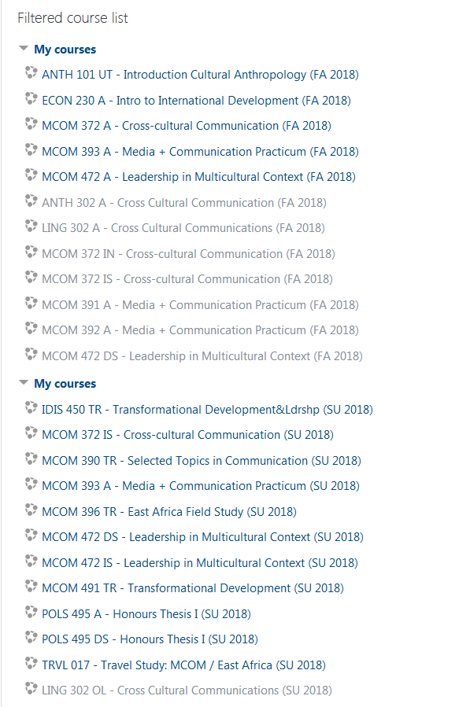

# Creating a filtered course list

To create a Filtered Course List please take the following steps:

Go to your dashboard and click the "**Customize this page**" button

Click "**Add a block**"  and select "**Filtered course list**"

In the "Filtered course list" block, click the gear icon and select "**Configure filtered course list block**"

You can choose the courses you want to appear on your list. Eg. If you want to see a list of courses from a previous term, enter: **shortname \| exp \| My courses \| \(SP18\)** or any other term of your choice. Then **Save Changes**

An example of what a filtered course list for the Fall 2018 and Summer 2018 semesters would look like as shown below

## For Further Assistance

The eSupport Team is a group of dedicated students and staff members who work to improve the Moodle learning experience for students and Instructors alike. A member of TWU Extension, the eSupport Team is located in the Northwest Building of TWU’s Langley campus. Whether your question is simple or complicated, a Team member will get back to you in a timely manner with a thorough response. eSupport also offers Basic and Advanced Moodle trainings, either in-person or over the phone. Contact [eSupport](https://trinitywestern.teamdynamix.com/TDClient/Requests/ServiceDet?ID=16141) for assistance making Moodle work for you.

