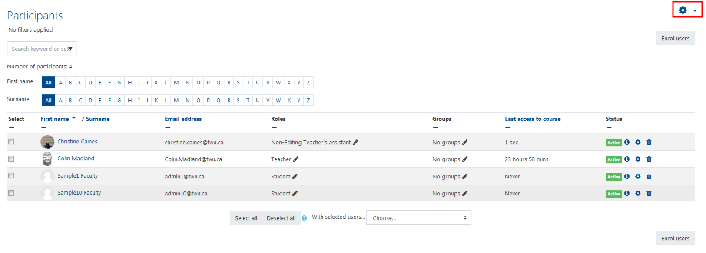
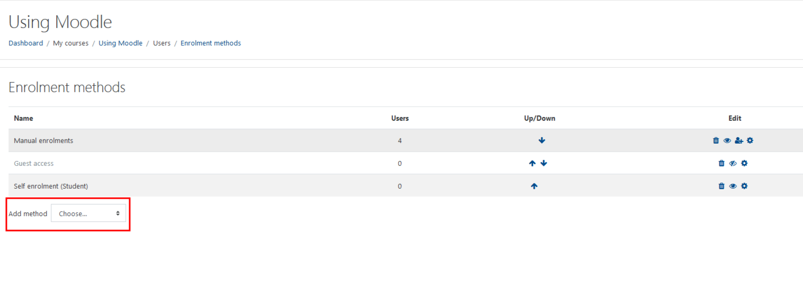
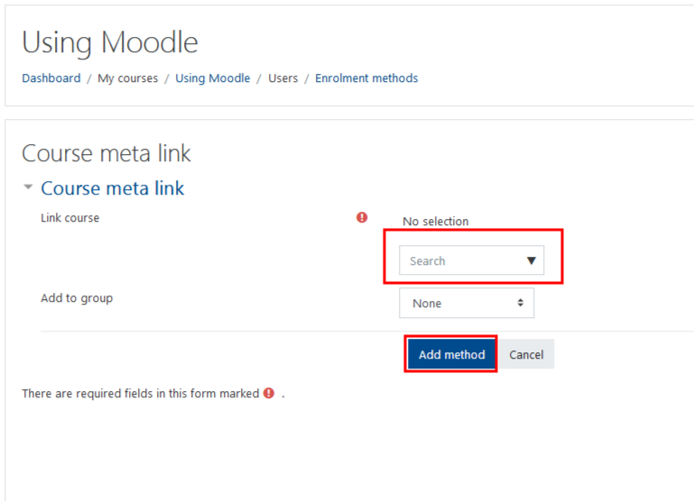
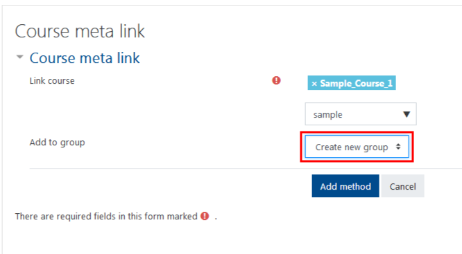
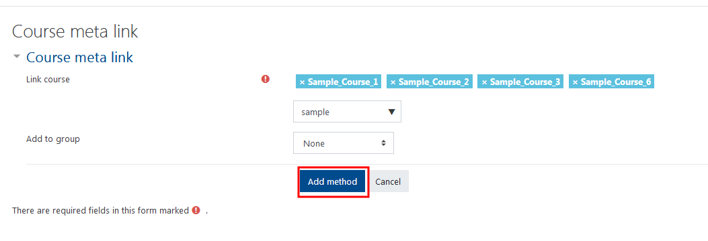
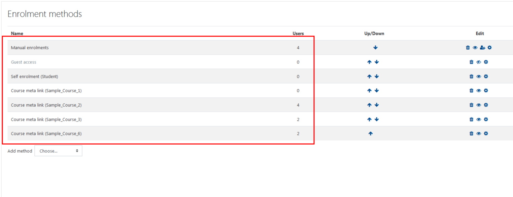
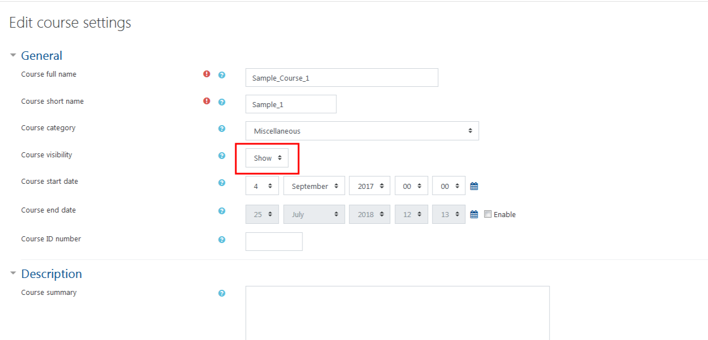

# Creating a Meta-Course

Meta-Courses, **\(formerly known as Parent Courses\)** are your method of amalgamating multiple courses into one location. This is especially helpful when you have multiple courses with the same course content.

## Sign in to the course you would like to use as the meta-course.

From the list select 'Participants', at the top right hand corner choose the drop down settings, then select 'Enrollment Methods'

## Click 'Add method', then choose 'Course meta link'.

### Type the name of the course you want to link and select it in the search box.

You can repeat the search to add more courses.

You have the option of adding the students from each course to their own group in the meta course, but this is typically not necessary.

Click 'Add method'.

### Congrats! Your Meta-Course is created.

You can now see the new users that have been added, now that you have completed your Meta-course Instructions. This is important to note when creating meta courses as you will want to make sure you keep track and ensure that you have the correct number of users in your course.

### So, you've made a meta course...

Now that your meta-course is created, students can see the meta-course and the respective courses connected to it. To help everyone avoid confusion seeing multiple courses we encourage you to follow the next instruction. Below is a screen shot of what students will see.

## As a final step, you should hide the child courses to avoid confusion.

In your 'child courses', 'Edit settings', then change the visibility to 'Hide". then save and close.

#### For Further Assistance

The eSupport Team is a group of dedicated students and staff members who work to improve the Moodle learning experience for students and Instructors alike. A member of TWU Extension, the eSupport Team is located in the Northwest Building of TWU’s Langley campus. Whether your question is simple or complicated, a Team member will get back to you in a timely manner with a thorough response. eSupport also offers Basic and Advanced Moodle trainings, either in-person or over the phone. Contact [eSupport](https://trinitywestern.teamdynamix.com/TDClient/Requests/ServiceDet?ID=16141) for assistance making Moodle work for you.

