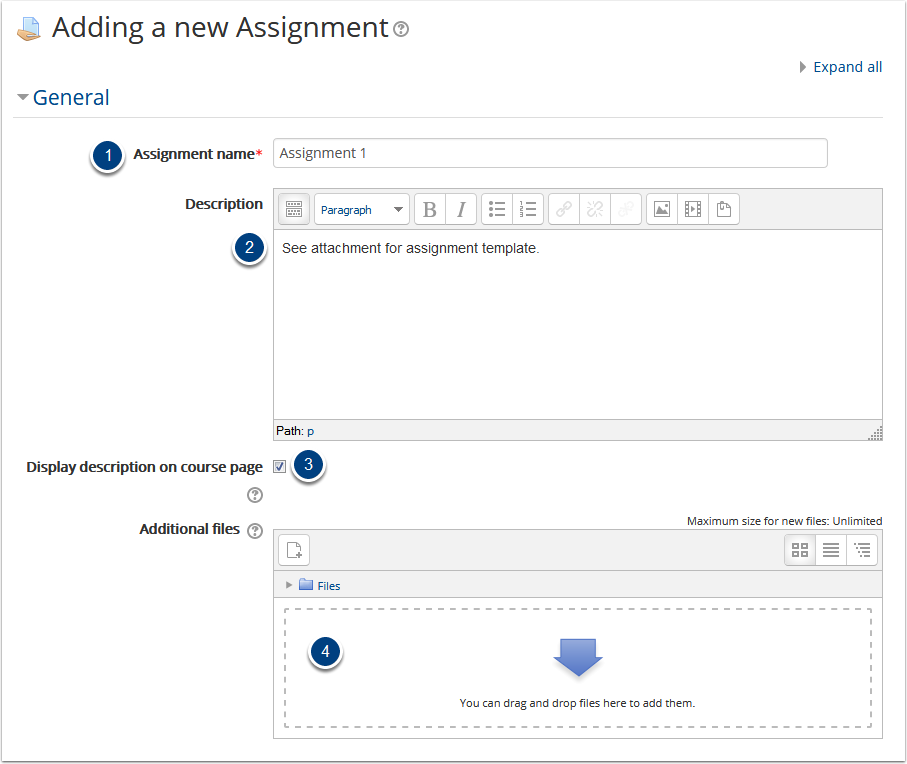
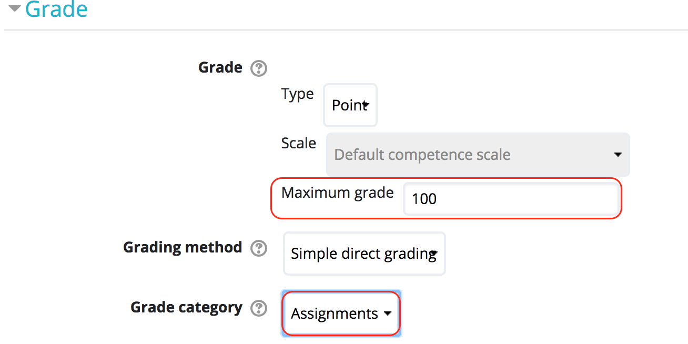
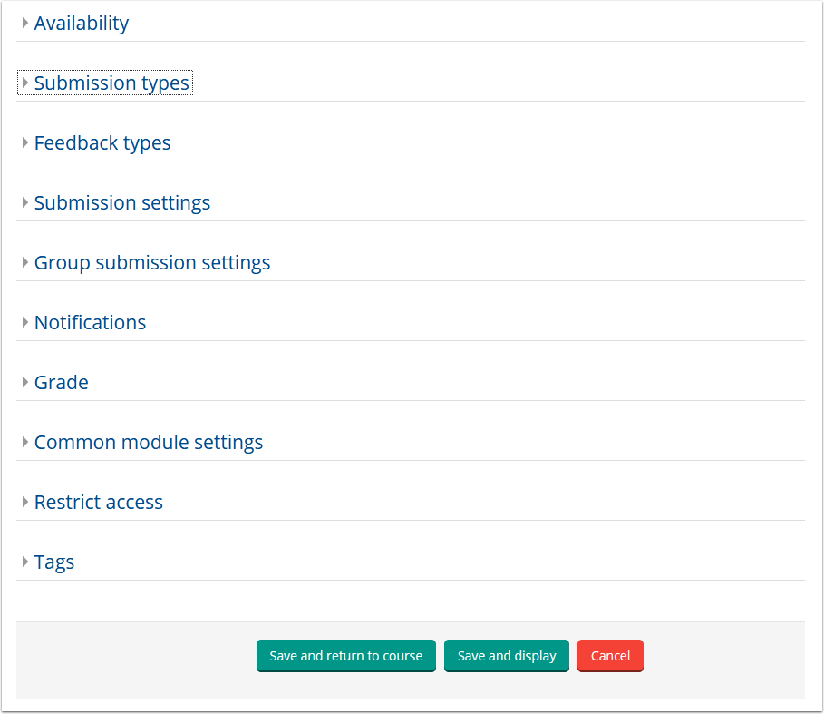

# Creating an Assignment Dropbox

The most commonly used Activities, Assignment Dropboxes allow students to submit assignments online. This is convenient for Instructors, as it eliminates the possibility of losing a student’s paper and as it enables students to submit their assignments immediately. It also connects to gradebook so students can see their grades once they are corrected.

## Remember: Always turn editing on.

Choose Assignment from the Activity menu. Then click "**Add**" at the bottom of the window.

## Next, add details.

The next page is entitled Adding a New Assignment.

1. Supply a Name for the Assignment. Make sure it is something that your students will recognize.
2. Enter a Description of the Assignment.
   1. This is where you should publish the details and requirements of the assignment.
3. You can check this box if you wish the description be displayed on the course page.
4. Be sure to add any neccessary attachments here.
   1. Attachments might include datasets, example submissions, or other resources that students need to complete the assignment.

## Edit 'Grade' settings.

You can change the maximum grade to align with your marking rubric.

Add the assignment to the appropriate 'Grade category' using the dropdown menu.

## Other options for your assignment dropbox.

You may set the parameters for your assignment dropbox using the following options. You can set the due date and cut off date, submission type, add the max grade and assign it to a category in your gradebook, etc.

**Note** that because you must select a time from the 24 hour clock, it is often convenient to make an assignment due at 23:55, or 11:55PM, on the date that it is due to avoid due date mix ups for students.

Once options are selected click **Save and return to course or display** to preview your drop box.

## For Further Assistance

The eSupport Team is a group of dedicated students and staff members who work to improve the Moodle learning experience for students and Instructors alike. A member of TWU Extension, the eSupport Team is located in the Northwest Building of TWU’s Langley campus. Whether your question is simple or complicated, a Team member will get back to you in a timely manner with a thorough response. eSupport also offers Basic and Advanced Moodle trainings, either in-person or over the phone. Contact [eSupport](https://trinitywestern.teamdynamix.com/TDClient/Requests/ServiceDet?ID=16141) for assistance making Moodle work for you.

