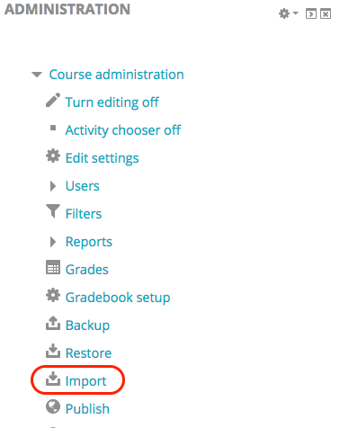
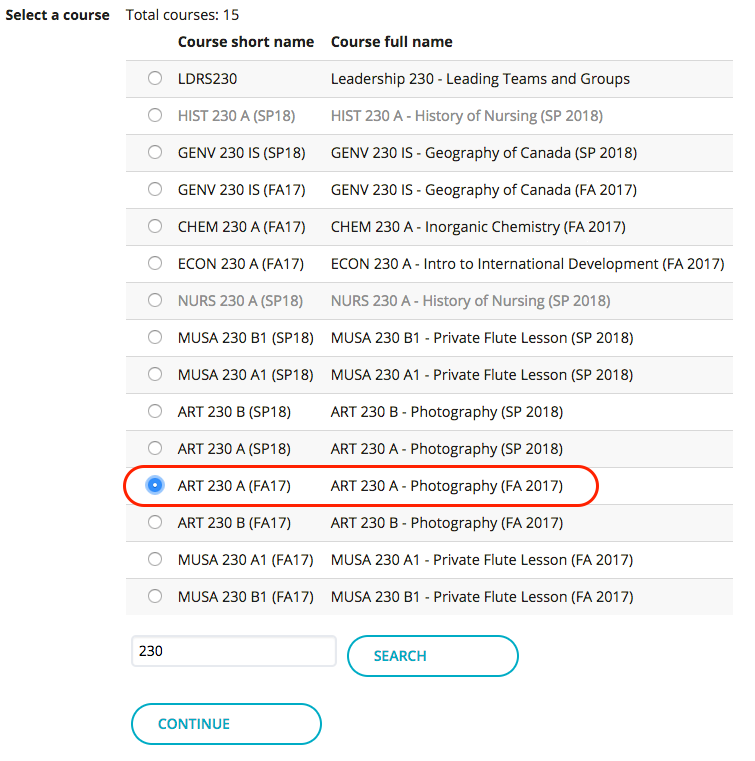
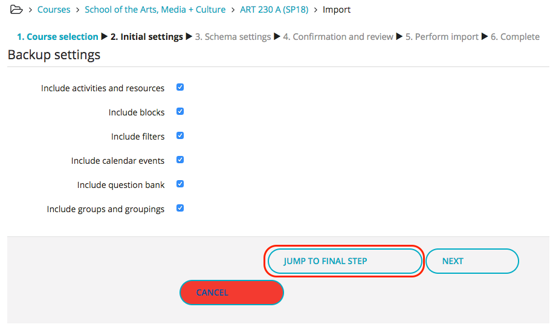
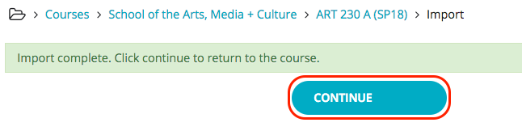

# Importing content from a previous cohort

Navigate to the new site for your course.

## Click 'Import' in the Administration block.

## Use the search tool to find your previous course, select it, and click 'Continue'.

## Click 'Jump To Final Step' or 'Next'.

If you choose 'Next', you can select which items you want to import from the course.

## Click 'Continue' to go to your course.

Don't forget to update your syllabus and assignment dues dates!

