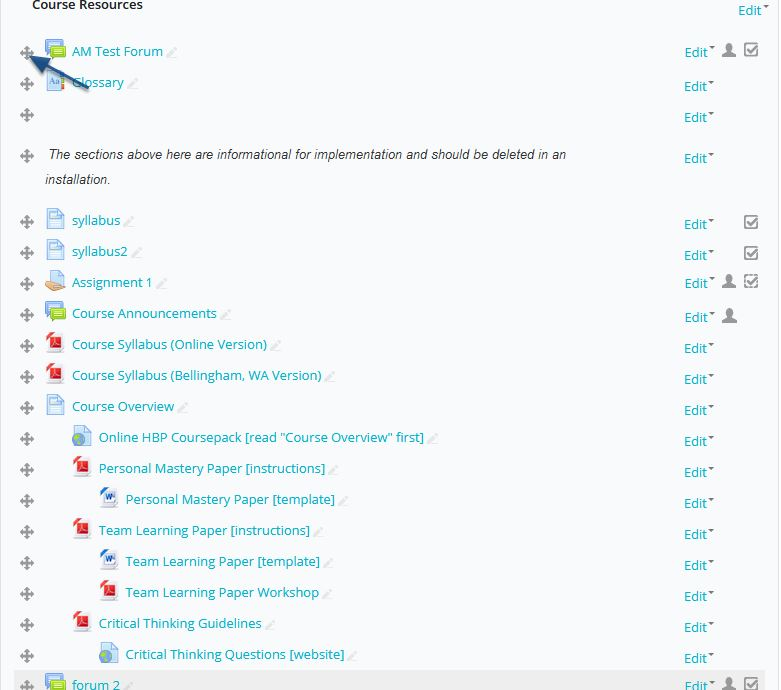
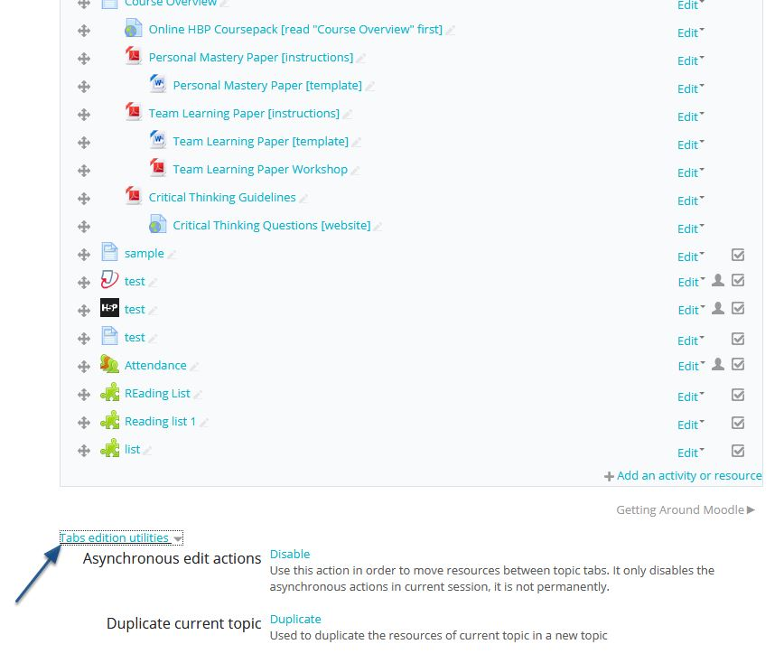
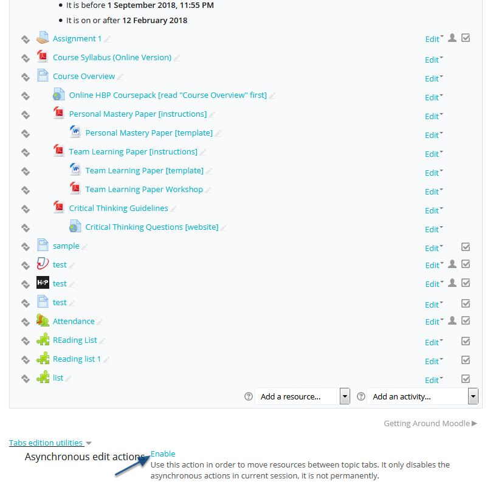
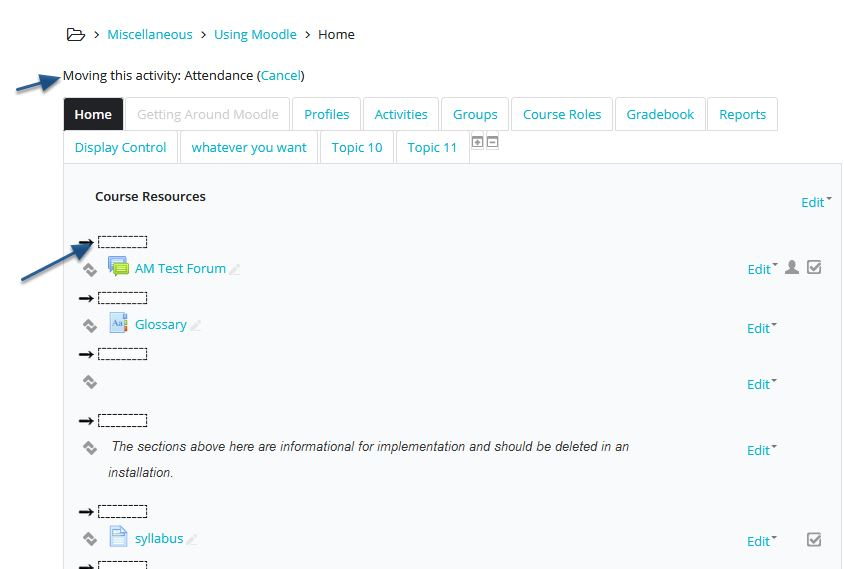

# Reordering Content in Moodle

## Reordering within Sections

When editing anything in Moodle be sure to 'Turn Editing On'. Moving items in sections of Moodle once editing is turn on is pretty easy. Look for the four directional arrow. Once you've selected the item you can drag and drop within this section. 

### Moving cross-sectionally is a bit different.

If your course format is in 'Onetopic' you will need to adjust the Tab utilities function at the bottom of the page. With editing turn on, scroll to the bottom of the page till you see the 'Tab Edition Utilities' function, and disable 'Asynchronous edit actions'. 

### Yea, we know, who knew? 

This alters the icon from being a four directional arrow to a two directional arrow, which allows you to move content cross-sectionally. 

### Progressing...

Once you've selected an item to reposition, the display may look like below. The top of the page indicates what item is being moved. The boxs indicate that you may select any spot within the selection or another tab to move the content. 

### Content can now be placed anywhere within the course.

Congrats!!! You are now feel free to move about the cabin. 

