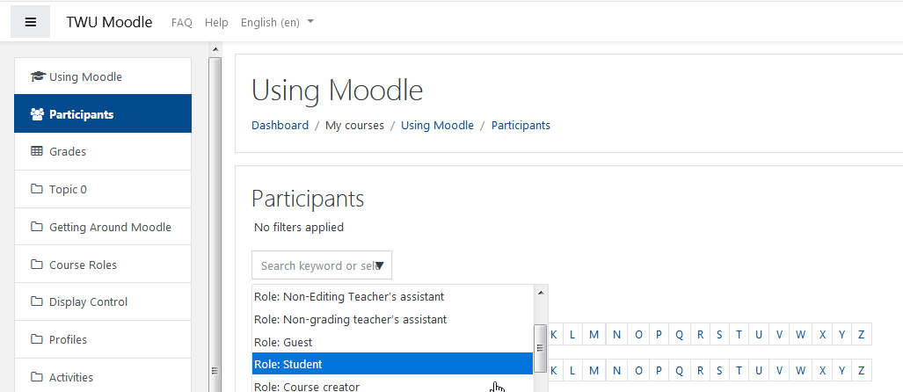
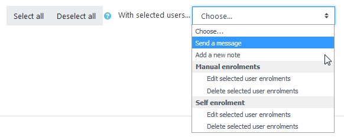

# Sending Mass Messages

Begin by clicking on **Participants** located on the left side of your screen.

From there, you will want to use the drop down menu and select **Role: Student.**

Now scroll down to the bottom of the page and in the middle you will see the button **Select All;** make sure you click it.

Then use the **With selected users...** drop down menu and click on **Send a message**, which is highlighted above.

Type out the message you want every participant to receive and when ready click send!

### Well done.

### For Further Assistance

The eSupport Team is a group of dedicated students and staff members who work to improve the Moodle learning experience for students and Instructors alike. A member of TWU Extension, the eSupport Team is located in the Northwest Building of TWU’s Langley campus. Whether your question is simple or complicated, a Team member will get back to you in a timely manner with a thorough response. eSupport also offers Basic and Advanced Moodle trainings, either in-person or over the phone. Contact [eSupport](https://trinitywestern.teamdynamix.com/TDClient/Requests/ServiceDet?ID=16141) for assistance making Moodle work for you.

