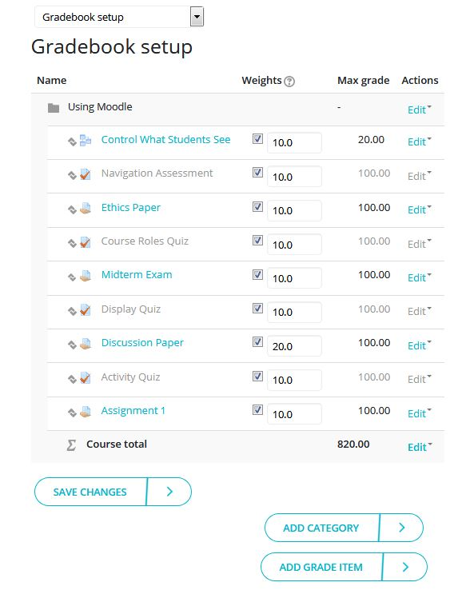
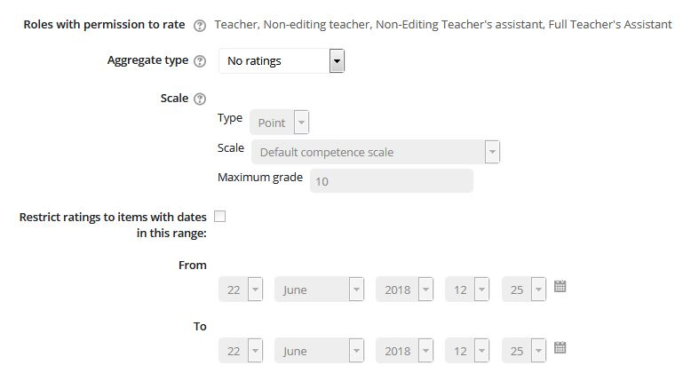
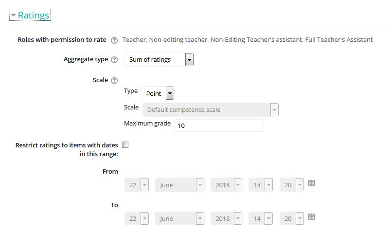

# Setting up Grading for Forums

You may notice that your current forum may not have an entry in your gradebook. If you are hoping to make your gradebook a gradable part of your course please follow these next steps. 

In your forum's settings you will need to scroll down to the **"Ratings"** option.

The default setting is an Aggregate type "**No Ratings"** 

You'll want to change the aggregation appropriately for your gradebook, feel free to investigate they appropriate type for you by selecting the ? next to each setting. Next, choose the appropriate "Scale" type, usually "Point" but you may also choose "Scale" if desired. Enter the desired max grade. You may also place date restrictions on the forum as well. 

Once one's forum settings are all entered, 'Save and Return to Course". Feel free to review your gradebook and set the appropriate weights with the new addition. 

