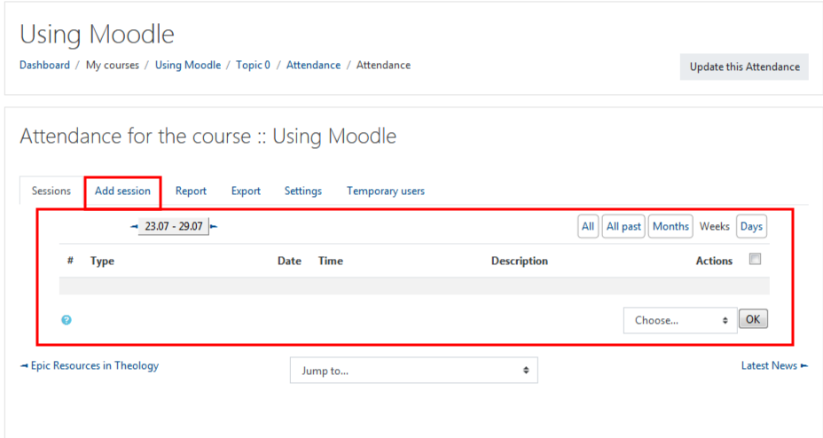
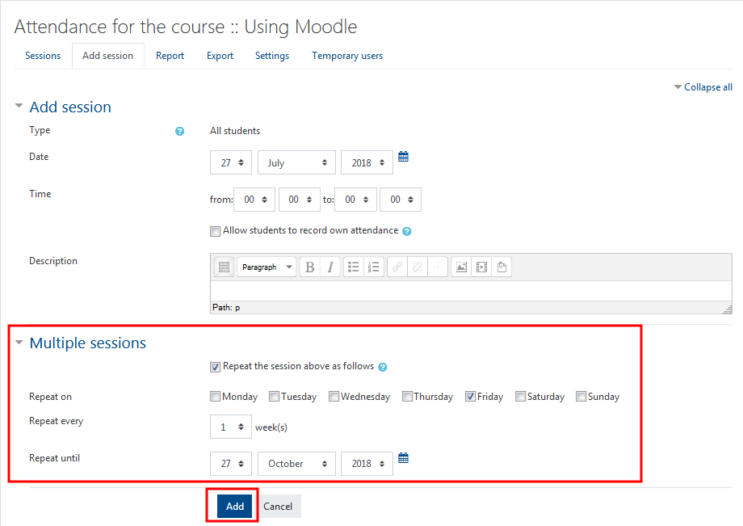
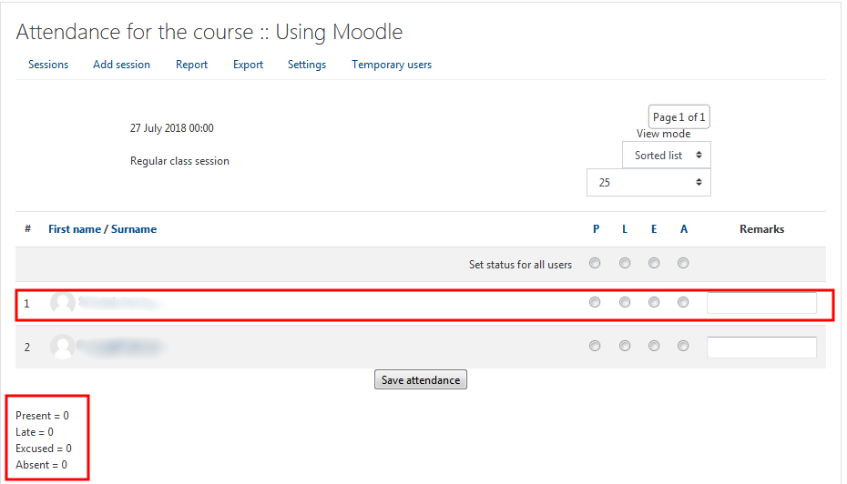

# Setting Up the Attendance Activity

The 'Attendance' activity can be accessed by 'Turning Editing On' and 'Add an activity'.

Once you've accessed the Activity listing, select 'Attendance', then 'Add'.

You have now added a new 'Attendance' Activity to your course page. This next steps allows you to add the settings to the feature. You may choose to add a grade to your attendance if it is apart of your course requirements, set restrictions, track the activity or create groups, the choice is yours. **NOTE: If you have questions about the settings be sure to select the question mark by each setting for further clarity.**

The next step is to 'Add Session'. There is an option to add one or multiple sessions depending on your needs.

To add a session\(s\) the following details should be added.

Add the appropriate start day of recording attendance. You have the option of adding the time of the class if desired. You also have the option of adding a description, you may add specifiers for example for students to see.

**You may select if you wish to make multiple sessions added all at once.** For example: In the 'Multiple Sessions' portion of the page, check the box **'Repeat the session above a follows'**, choose the day attendance should be recorded, and choose 1 select the date you wish to cut off attendance . You may choose the day\(s\) of the week. The number of times can also be stipulated, as well as adding a cut off date.

Finally, 'Add'.

## Congrats, you did it!

You have established an attendance function on your course page. 

To add attendance every week under the 'Actions' column select the 'Take Attendance' option and fill in the appropriate details for each participant. You can also add remarks for further detailing.

### For Further Assistance

The eSupport Team is a group of dedicated students and staff members who work to improve the Moodle learning experience for students and Instructors alike. A member of TWU Extension, the eSupport Team is located in the Northwest Building of TWU’s Langley campus. Whether your question is simple or complicated, a Team member will get back to you in a timely manner with a thorough response. eSupport also offers Basic and Advanced Moodle trainings, either in-person or over the phone. Contact [eSupport](https://trinitywestern.teamdynamix.com/TDClient/Requests/ServiceDet?ID=16141) for assistance making Moodle work for you.
