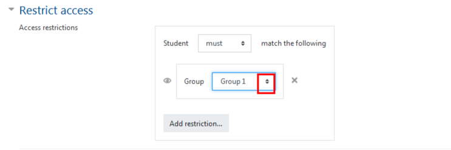
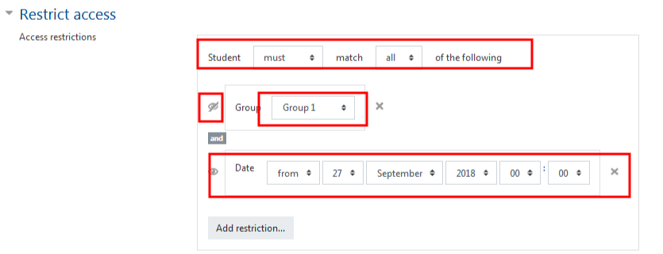

# Using Groups \(Separate groups and Restricted Access Content\)

## Option 1 - Separate & Visible Groups

The most efficient way to incorporate Groups to course items is to turn on **Separate groups** on your course page, once you've completed creating the groups and the items. Separate groups limits students to see only the content connected with their particular group. This option gives students the ability to discuss more personal matters, or to plan for a group project without their ideas being seen by others.

To incorporate this type of Group:

**Make sure that editing is turned on.**

Scroll to the content you would like to incorporate Groups, find the icon that looks like the silhouette of a person on the far right hand side of the page. Click on this icon once.

\*Note that the forum will only apply 'Separate Groups' once Groups have been created and students have been assigned to them. \([Learn to create groups here.](https://twonline.gitbook.io/moodlefaq/~/edit/drafts/-LIReiRkB7ZiltBhboHz/faculty/creating-groups-and-groupings)\)

**Visible Groups**

Each group works in their own group, but can also see other groups. \(The other groups' work is read-only.\)

Make sure that editing is turned on. Follow the instructions as above.

\*Note: The pic below shows how each silhouette looks with each group option.

## Option 2 - Restricting Access

Another way to incorporate "Separate groups" is to create different content specifically for specific Groups.

An example: You have a class of students and you have added a Directed Study student to see your content, but you have additional content created for that student as well, this option may be helpful for you.

To incorporate this type of Group, do the following while creating your content \(**we'll be using the forum post in this example**\):

Make sure that editing is turned on, and begin the creation of your forum by going to the desired section, and clicking "Add an activity/resource."

From the list that pops up, select "Forum" and then click "Add."

## Enter all the necessary details

There is a number of menu options, scroll down to "Restrict access".

## There are a number of options to restrict content.

Select "Add Restriction"

Choose either the "Group" or "Grouping" option.

**We choose 'Group' in this instance.** Feel free to set the appropriate groups and restriction as needed.

To recap with this option you can select the group and restrict the visibility. \*Feel free to hover over the eye to see which option is being used. Students in the group you have specified will see the content, if not you can set it to be grayed out or disappear completely.

Once completed 'Save and return to course'.

### For Further Assistance

The eSupport Team is a group of dedicated students and staff members who work to improve the Moodle learning experience for students and Instructors alike. A member of TWU Extension, the eSupport Team is located in the Northwest Building of TWU’s Langley campus. Whether your question is simple or complicated, a Team member will get back to you in a timely manner with a thorough response. eSupport also offers Basic and Advanced Moodle trainings, either in-person or over the phone. Contact [eSupport](https://trinitywestern.teamdynamix.com/TDClient/Requests/ServiceDet?ID=16141) for assistance making Moodle work for you.

