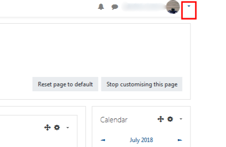
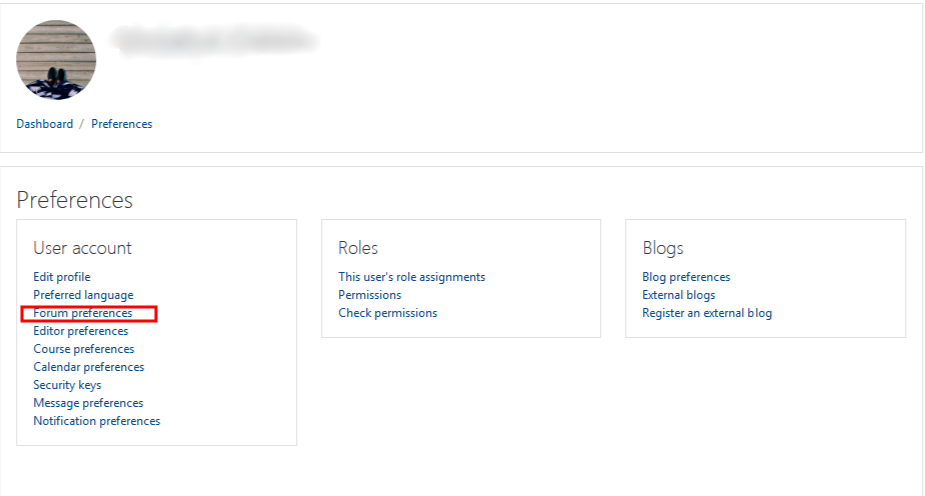
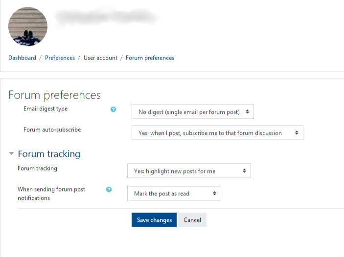

# Forum Preferences

## Below are instructions on how to alter forum preferences.

Select your user profile drop down menu on the top right hand corner.

## Select ‘Preferences’.

## Next select ‘Forum Preferences’.

There are many options to choose from. Opt to be notified about forum posts, or track forum posts. For further details access the **?** located next to each option.

Once settings are complete, 'Save Changes'.

## For Further Assistance

The eSupport Team is a group of dedicated students and staff members who work to improve the Moodle learning experience for students and Instructors alike. A member of TWU Extension, the eSupport Team is located in the Northwest Building of TWU’s Langley campus. Whether your question is simple or complicated, a Team member will get back to you in a timely manner with a thorough response. eSupport also offers Basic and Advanced Moodle trainings, either in-person or over the phone. Contact [eSupport](https://trinitywestern.teamdynamix.com/TDClient/Requests/ServiceDet?ID=16141) for assistance making Moodle work for you.

