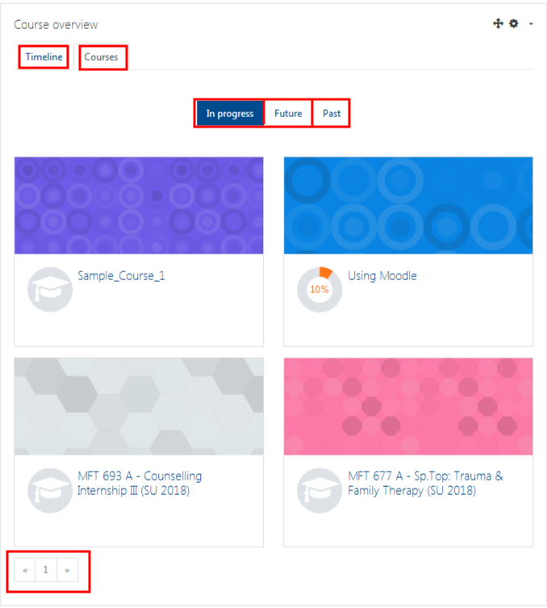

# Why isn't my course showing in Moodle?

There are several reasons why your course might not be showing in Moodle.

* Your instructor has hidden the course while they are updating it.
* You are on the waitlist or pre-registered for the course.
  * Please contact the office of the Registrar.
* You are not up-to-date on your tuition payments.
  * Please contact the office of the Registrar.
  * Once you are up-to-date, your status will be updated.
* You registered very recently and our system has not synchronized yet.
  * We synchronize Moodle with Jenzabar \(our database of registrations\) at 1:30 pm and 6:30 pm weekdays.
* Your dashboard is only showing some of your courses.
  1. Scroll to the bottom of courses listed, scroll through other pages
  2. Have a look through your 'Past', 'Future' 'In Process' tabs. 
### NOTE: There has been some changes with this one, as your new Dashboard is divided into a number of tabs such 'Timeline', 'Courses', 'Future', 'In Progress' and 'Past'. Your new Dashboard should resemble the picture below. 

You may also have multiple pages, be sure to look for additional pages on your 'Courses' tab.

## For Further Assistance

The eSupport Team is a group of dedicated students and staff members who work to improve the Moodle learning experience for students and Instructors alike. A member of TWU Extension, the eSupport Team is located in the Northwest Building of TWU’s Langley campus. Whether your question is simple or complicated, a Team member will get back to you in a timely manner with a thorough response. eSupport also offers Basic and Advanced Moodle trainings, either in-person or over the phone. Contact [eSupport](https://trinitywestern.teamdynamix.com/TDClient/Requests/ServiceDet?ID=16141) for assistance making Moodle work for you.

