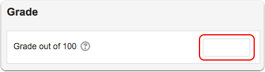

# Grade an assignment

## 1. Click the assignment link.

![\[1\]: images/grade-an-assignment/click-the-assignment-link.png](../.gitbook/assets/click-the-assignment-link.png)

## 2.  Click 'Grade'.

![2\]: images/grade-an-assignment/click--grade-.png\]\(/assets/click--grade-.png\)](../.gitbook/assets/click-grade.png)

## 3.  Click the link to the submitted document.

If a student has submitted a document, you need to click the link to download it to your computer.

![3\]: images/grade-an-assignment/click-the-link-to-the-submitted-document.png ](../.gitbook/assets/click-the-link-to-the-submitted-document.png)

## 4.  Open the file from your 'Downloads' folder.

It is recommended that you use 'Track Changes' in MS Word to enter your comments and feedback.

## 5.  Save the graded file with a new file name to your computer.

Not pictured.

## 6.  Enter the student's numeric grade into the 'Grade out of \#\#' field.

## 7.  Enter comments in the 'Feedback comments' field \(optional\).

![5\]: images/grade-an-assignment/enter-comments-in-the--feedback-comments--field--optional-.png](../.gitbook/assets/enter-comments-in-the-feedback-comments-field-optional.png)

## 8.  Drag the graded file to the 'Feedback files' window in Moodle.

![6\]: images/grade-an-assignment/drag-the-graded-file-to-the--feedback-files--window-in-moodle.png](../.gitbook/assets/drag-the-graded-file-to-the-feedback-files-window-in-moodle.png)

## 9. Click 'Save changes' to send your feedback to the student.

![7\]: images/grade-an-assignment/click--save-changes--to-send-your-feedback-to-the-student.png ](../.gitbook/assets/click-save-changes-to-send-your-feedback-to-the-student.png)

