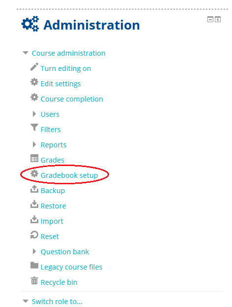
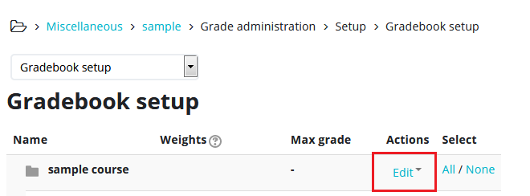
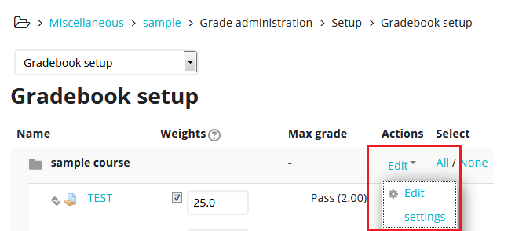
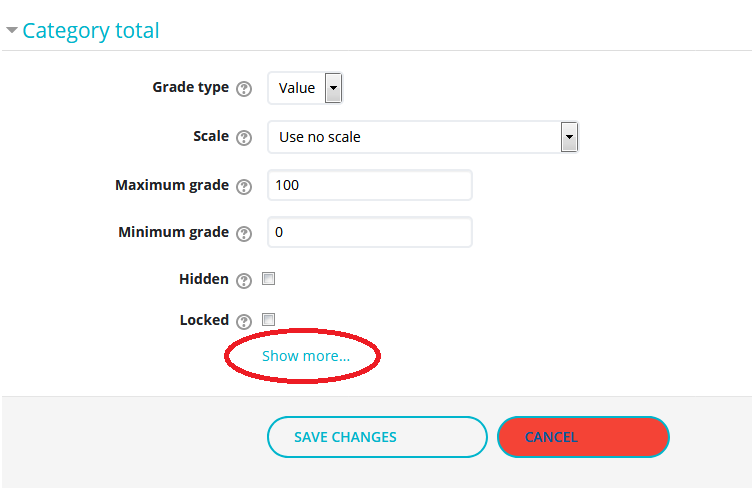
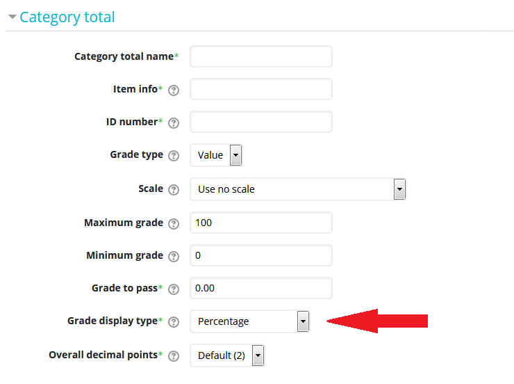
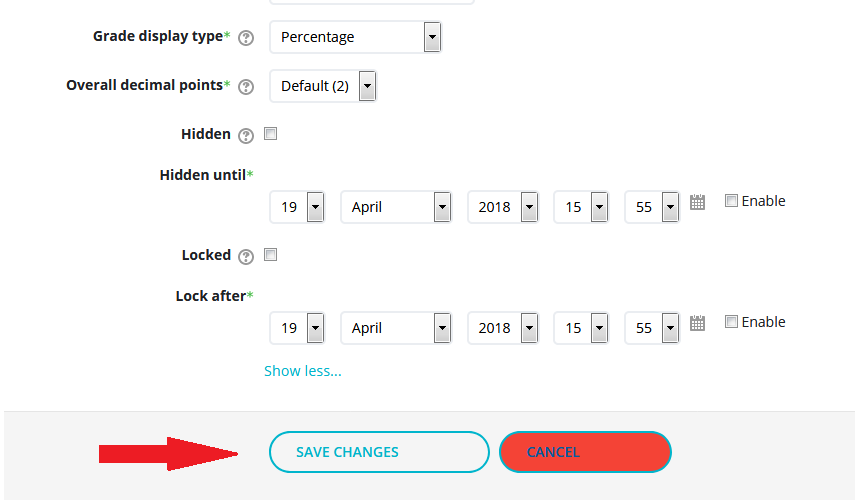

# Grade an assignment

## 1. Click the assignment link.

## 2.  Click 'Grade'.

## 3.  Click the link to the submitted document.

If a student has submitted a document, you need to click the link to download it to your computer. You

## 4.  Open the file from your 'Downloads' folder.

It is recommended that you use 'Track Changes' in MS Word to enter your comments and feedback.

## 5.  Save the graded file with a new file name to your computer.

## 6.  Enter the student's numeric grade into the 'Grade out of 100' field.

## 7.  Enter comments in the 'Feedback comments' field \(optional\). Drag the graded file to the 'Feedback files' window in Moodle.

## 9. Click 'Save changes' to send your feedback to the student.

## For Further Assistance

The eSupport Team is a group of dedicated students and staff members who work to improve the Moodle learning experience for students and Instructors alike. A member of TWU Extension, the eSupport Team is located in the Northwest Building of TWU’s Langley campus. Whether your question is simple or complicated, a Team member will get back to you in a timely manner with a thorough response. eSupport also offers Basic and Advanced Moodle trainings, either in-person or over the phone. Contact [eSupport](https://trinitywestern.teamdynamix.com/TDClient/Requests/ServiceDet?ID=16141) for assistance making Moodle work for you.

