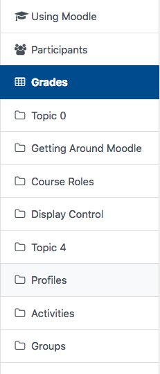
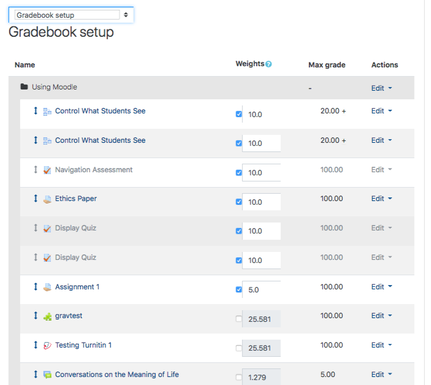
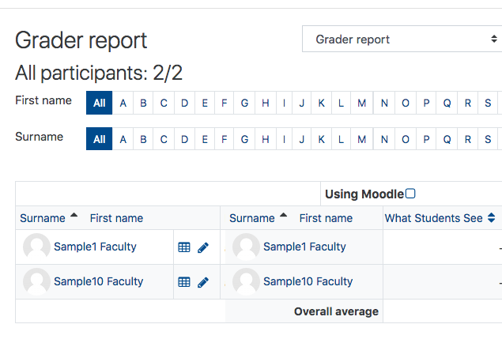

# Gradebook \(Instructors Overview\)

The Moodle Gradebook is a valuable but complex tool. Because of its complexity, eSupport recommends that instructors set up a Gradebook training session for a personalized tutorial. This is especially important for first time users. See the bottom of this page for information on contacting eSupport.

## Basic Details

The Gradebook collects and organizes the grades for the class. It automatically pulls in gradable activities \(e.g. Assignment Dropboxes, Quizzes\) and displays the grades for those activities once you have graded them. The Gradebook will calculate the final grade for each student based on the method you choose; however, it does not submit final course grades to the Office of the Registrar \(yet\). Using the Gradebook keeps students aware of their progress in the course, motivating them to stay on track.

After creating all the assignments, forums etc for your course, it is now time to setup your Gradebook.

**NOTE: If you desire Gradebook to reflect grades accurately, please ensure that the 'Weights' are equal to 100%.**

## Accessing Gradebook Options

On your course page, on the left menu select **Grades**.

## NOTE:

There are two views that a most important to be aware of, Gradebook Setup and Grader Reporter.

 

## To Access additional instructions on Gradebook Setup and Grader Report

Select the following links:

[Gradebook Setup](https://twonline.gitbook.io/moodlefaq/gradebook/gradebook-setup)

[Grader Report](https://twonline.gitbook.io/moodlefaq/gradebook/grader-report)

## For Further Assistance

The eSupport Team is a group of dedicated students and staff members who work to improve the Moodle learning experience for students and Instructors alike. A member of TWU Extension, the eSupport Team is located in the Northwest Building of TWU’s Langley campus. Whether your question is simple or complicated, a Team member will get back to you in a timely manner with a thorough response. eSupport also offers Basic and Advanced Moodle trainings, either in-person or over the phone. Contact [eSupport](https://trinitywestern.teamdynamix.com/TDClient/Requests/ServiceDet?ID=16141) for assistance making Moodle work for you.

