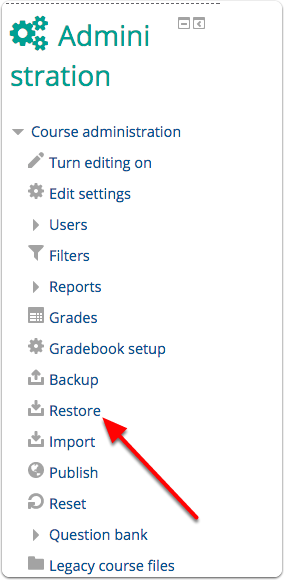
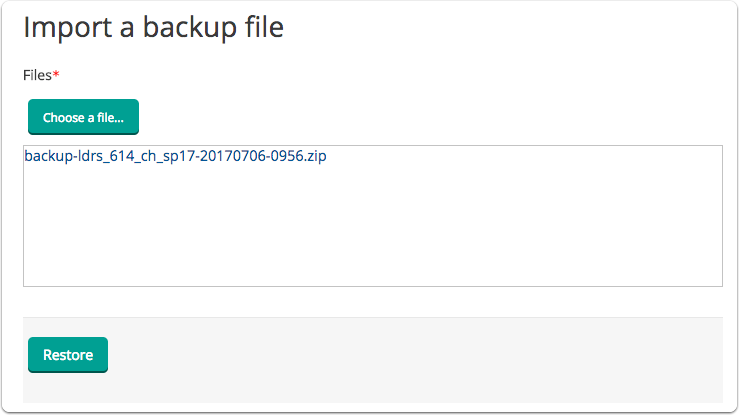
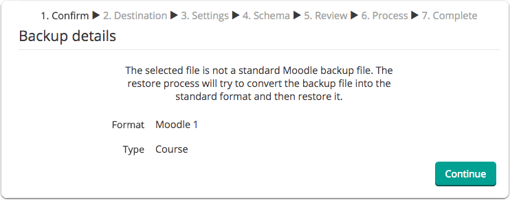
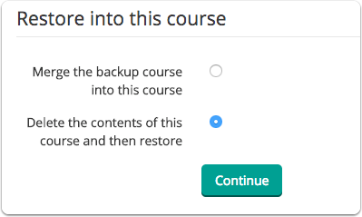
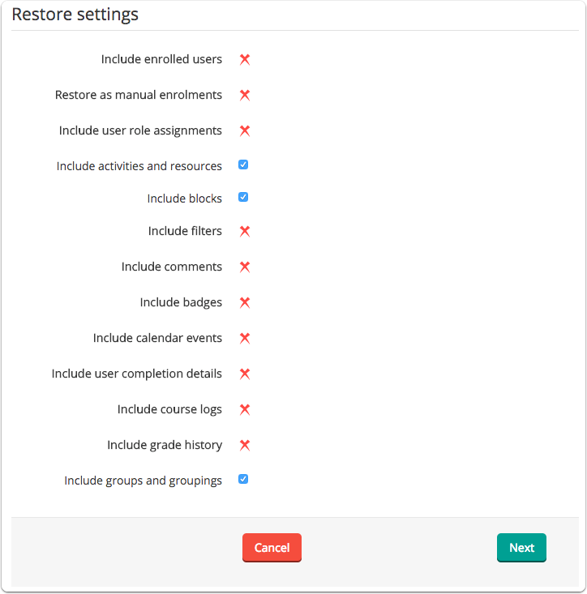
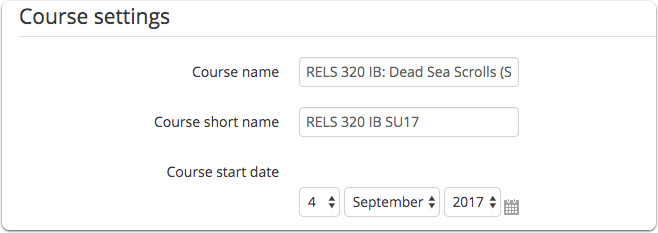
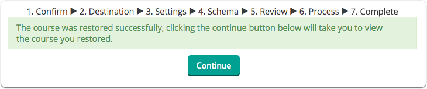

# Restore a course from MyCourses

## From your empty course site in Moodle, click 'Restore' in the 'Administration' block.

## Drag the zipped file \(this file must end in .zip\) to the area indicated in Moodle, then click 'Restore'.

Alternately, you can click 'Choose a file' to use the file picker.

## You will be warned that the file you have chosen is not a standard Moodle backup file. You should ignore this warning and click 'Continue'.

## Under the heading 'Restore into this course', choose 'Delete the contents...', then click 'Continue'.

## Use the checkboxes to control what you restore. Scroll to the bottom and click 'Next'.

## Set the Course start date to the first Monday of September.

Don't change any of the other settings.

## Scroll to the bottom of the page and click 'Next'.

## Scroll to the bottom of the page and click 'Perform restore'.

## Click 'Continue' to see your newly restored course.

### For Further Assistance

The eSupport Team is a group of dedicated students and staff members who work to improve the Moodle learning experience for students and Instructors alike. A member of TWU Extension, the eSupport Team is located in the Northwest Building of TWU’s Langley campus. Whether your question is simple or complicated, a Team member will get back to you in a timely manner with a thorough response. eSupport also offers Basic and Advanced Moodle trainings, either in-person or over the phone. Contact [eSupport](https://trinitywestern.teamdynamix.com/TDClient/Requests/ServiceDet?ID=16141) for assistance making Moodle work for you.

