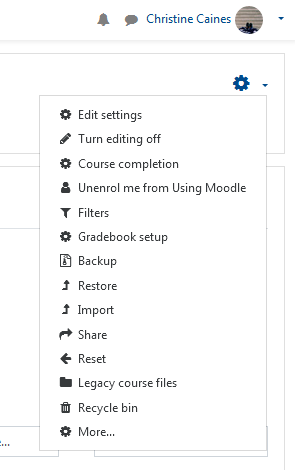
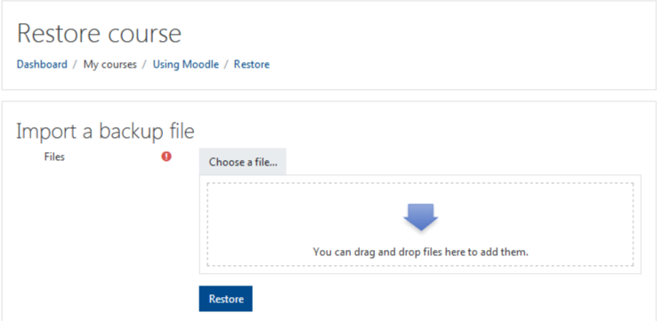
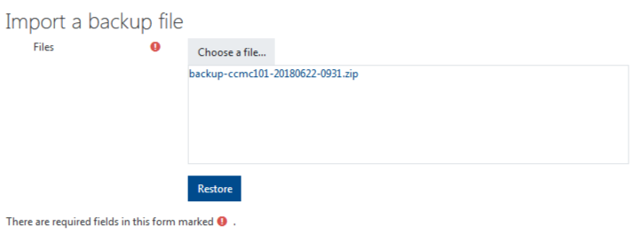
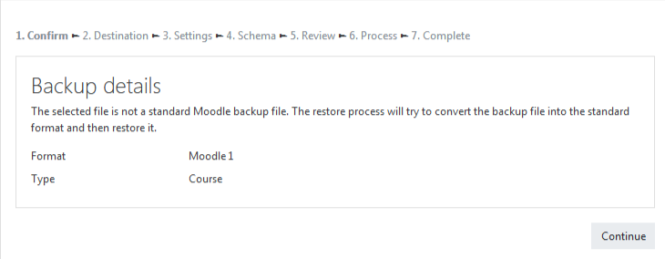
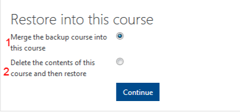
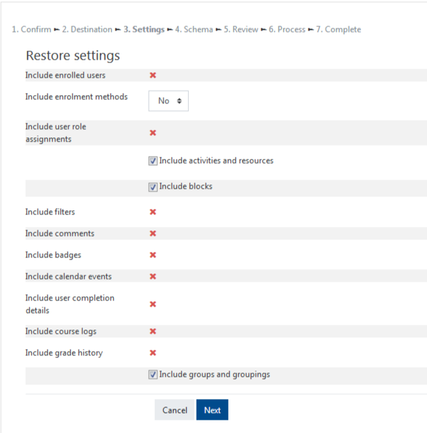
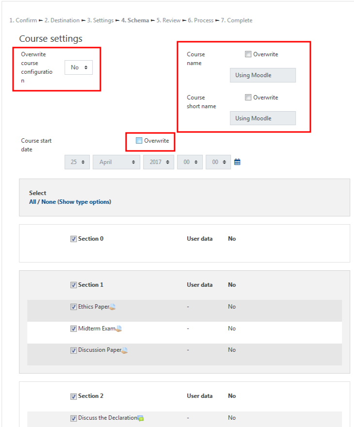
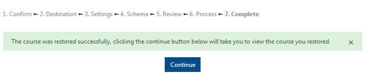

# Restore a course from MyCourses

## From your empty course site in Moodle, select 'Actions' on the top right hand corner of the page. Select 'Restore'.

## Drag the zipped file \(this file must end in .zip\) to the area indicated in Moodle, once it is fully uploaded then click 'Restore'.

Alternately, you can click 'Choose a file' to use the file picker.

**You will get a notification that the file you have chosen is not a standard Moodle backup file and click 'Continue'.**

## Under the heading 'Restore into this course', you may choose 'Delete the contents...', or 'Merge the backup', if you are restoring multiple backup files choose 'Merge', then 'Continue'.

## Use the checkboxes to control what you restore. Scroll to the bottom and click 'Next'.

## In course Settings, be sure to uncheck the 'Override' option as it will alter the details of the course you can coping content to. Scroll to the bottom of the page and click 'Next'.

## Scroll to the bottom of the page and click 'Perform restore'.

## Lastly, select 'Continue' to see your newly restored course.

## For Further Assistance

The eSupport Team is a group of dedicated students and staff members who work to improve the Moodle learning experience for students and Instructors alike. A member of TWU Extension, the eSupport Team is located in the Northwest Building of TWU’s Langley campus. Whether your question is simple or complicated, a Team member will get back to you in a timely manner with a thorough response. eSupport also offers Basic and Advanced Moodle trainings, either in-person or over the phone. Contact [eSupport](https://trinitywestern.teamdynamix.com/TDClient/Requests/ServiceDet?ID=16141) for assistance making Moodle work for you.

