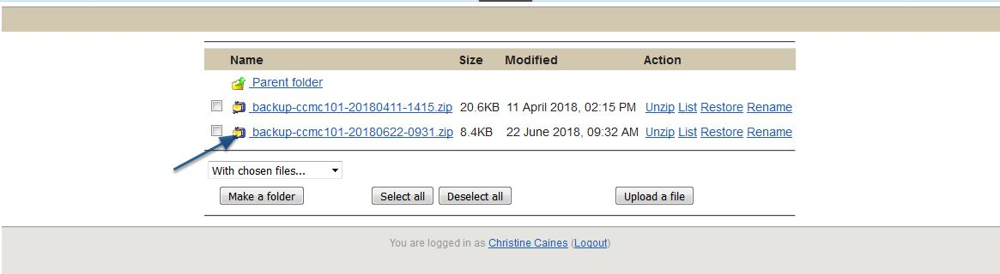
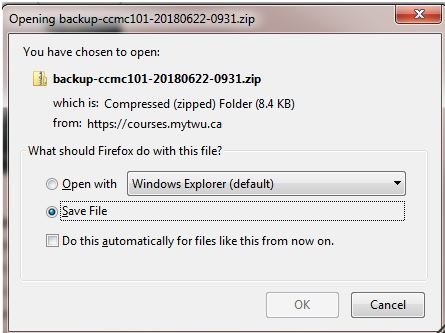

# Uploading Backup from MyCourses

### Congrats, so you've now completed your MyCourses backup and its within the limit of 256MB. Your next step is to upload your backup to your computer, follow the next steps.

Be sure to "**Save File**" rather than "**Open File**". Though your computer will not be able to read the file, once entered into Moodle the content will transfer appropriately. 

That's it, the uploaded file most likely will be stored in your 'Download' folder. Feel free to follow the instructions in the article "**Restore a Course from MyCourses**" for adding this content to your Moodle course. 

