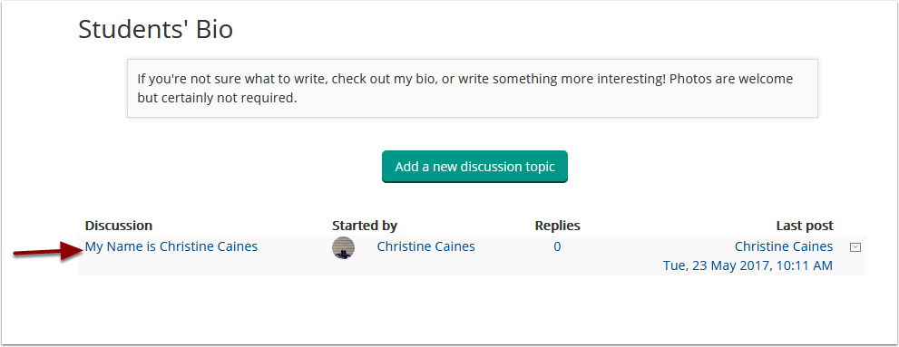
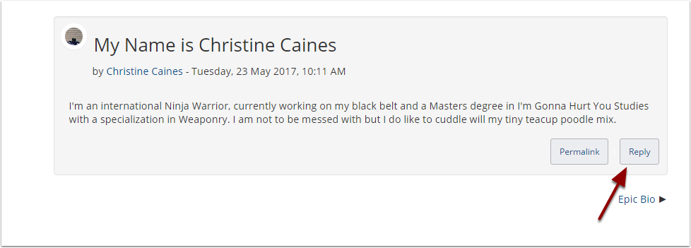
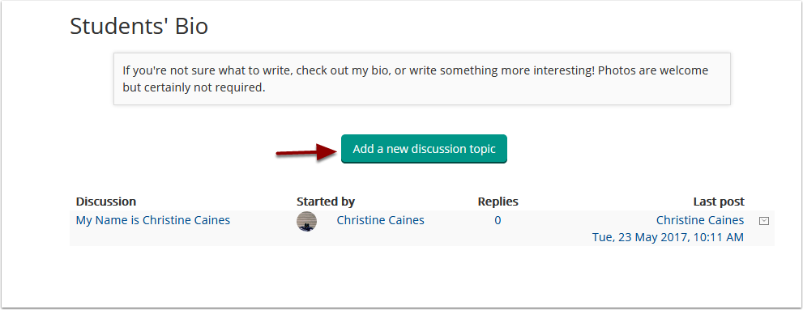
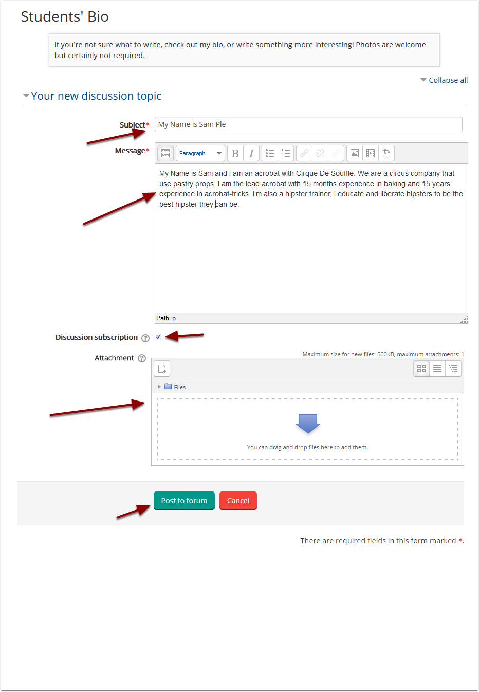

# Posting in a forum

## Select the Forum in which you want to post.

## Some forums may require you to respond to a discussion topic that the instructor has already posted.

If this is the case, when you arrive in the forum, find the current topic to which you are required to respond.

Within that topic, you will now see the already posted discussions by your classmates or Professor.

## Select the entry you would like to reply to.

To post a response to the discussion question, select the "Reply" button beneath the original post.

## To submit your own forum post.

Other instructors may require students to add their own discussion topics to a forum. If this is the case, click the "Add a new discussion topic" button. 

## Adding topic and content

Once you have clicked "Add a new discussion topic", you will be redirected to the page that allows you to create a new topic. You must include a title for the post first and content before you can submit your post. You may also add an attachment, maybe of a pic of you, to submit it with your post.You can use the check box if you would like to receive notifications when someone response to your post.

When you are finished, save your post by clicking "Post to forum" at the bottom of the page.

## Timeline to edit original posts.

You can edit your discussion topic for 30 minutes after posting. You can delete your posts or responses at any time.

## For Further Assistance

The eSupport Team is a group of dedicated students and staff members who work to improve the Moodle learning experience for students and Instructors alike. A member of TWU Extension, the eSupport Team is located in the Northwest Building of TWU’s Langley campus. Whether your question is simple or complicated, a Team member will get back to you in a timely manner with a thorough response. eSupport also offers Basic and Advanced Moodle trainings, either in-person or over the phone. Contact eSupport for assistance making Moodle work for you.

