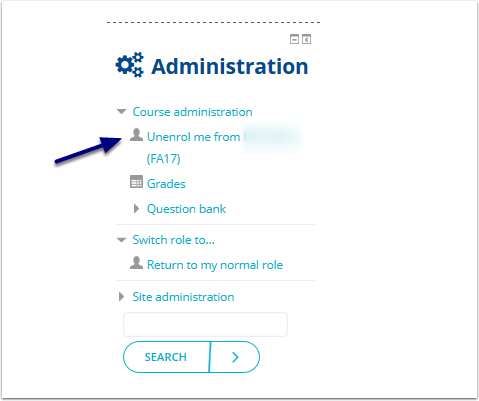
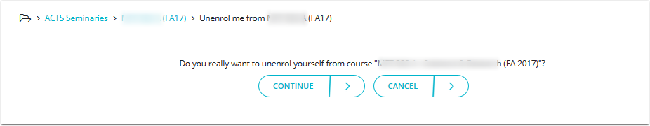

# Unenrol yourself from a course in Moodle

So you've dropped your course but you can still see that course in Moodle?

## How to unenrol yourself from a course in Moodle.

Some of you may have been added manually in the initial stages of our new Moodle implementation. In order to unenrol from this course please follow the next steps.

* Open the course you wish to unenrol yourself from, scroll down to the bottom of the page to your Administration block, and select 'Unenrol me from... "
* If you do not see the option to unenrol yourself, you are still registered for the course and you need to speak with the Registrar.

You'll get a confirmation message asking if you really want to unenrol yourself. If your answer is yes, select 'Continue'. Congrats the process is complete!

NOTE: This process is only necessary if you have de-registered from the course in your Student Portal and still can see that course in Moodle.

_**Unenrolling from Moodle will not de-register you from a course.**_

