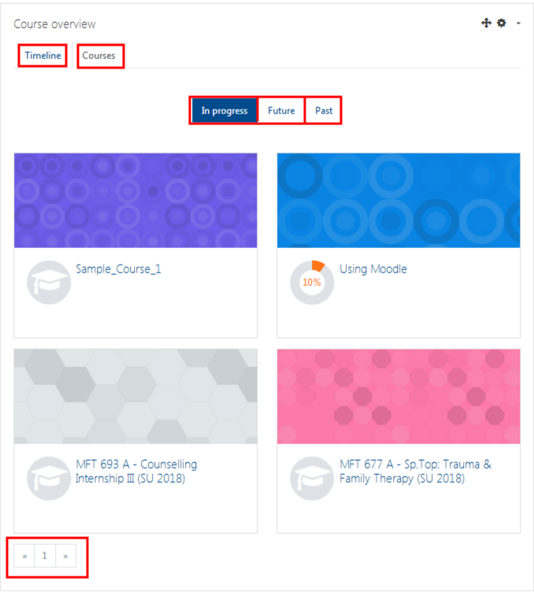

# Where are my courses?
There has been some changes with this one, as your new Dashboard is divided into a number of tabs such 'Timeline', 'Courses', 'Future', 'In Progress' and 'Past'. Your new Dashboard should resemble the picture below. 

You may also have multiple pages, if you are Faculty or Staff be sure to look for additional pages on your 'Courses' tab.

## For Further Assistance

The eSupport Team is a group of dedicated students and staff members who work to improve the Moodle learning experience for students 
